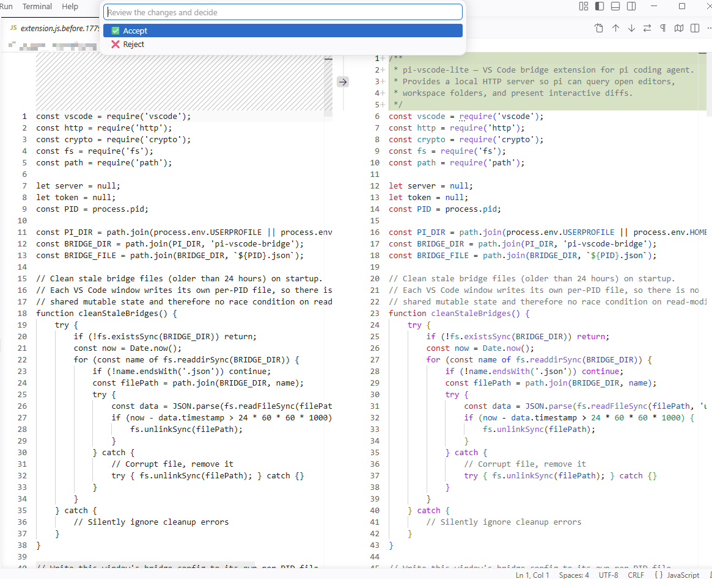

# pi-vscode-files

A [pi](https://github.com/nicx-next/pi-coding-agent) extension that prioritizes VS Code open files in `@` autocomplete.

When you type `@xxx` in pi's editor, files currently open in VS Code will appear at the top of suggestions, making it faster to reference files you're actively working on.

## Features

- **@ autocomplete** — VS Code open files appear at the top of `@` suggestions, with active/dirty files prioritized

- **Interactive diff** — automatic VS Code side-by-side diff with Accept/Reject for every `edit` tool change

## Installation

1. Install the VS Code extension `pi-vscode-lite`
2. Copy this extension to `~/.pi/agent/extensions/pi-vscode-files/`
3. Restart pi

## License

MIT
