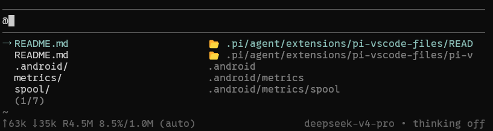

# pi-vscode-files

A [pi](https://github.com/earendil-works/pi/tree/main/packages/coding-agent) extension that integrates VS Code with pi, providing @ autocomplete and clickable diff links.

> **@ autocomplete** — type `@xxx` and VS Code open files appear first. **Clickable diff links** — diff hunks and edit results get clickable links that jump to VS Code.

## Features

- **@ autocomplete** — VS Code open files appear at the top of `@` suggestions, with active/dirty files prioritized


- **Clickable diff links** — diff hunk headers become clickable OSC 8 links and jump links are appended after diff code blocks/edit results.

- **VS Code Problems** — `/vscode-problems` loads VS Code diagnostics into the pi editor.

- **VS Code → pi prompts** — ask about the current VS Code selection and send the prompt to pi immediately.

## Commands

### pi commands

| Command | Description |
|---------|-------------|
| `/vscode-files` | Show VS Code open files |
| `/vscode-status` | Check VS Code bridge status |
| `/vscode-problems` | Load Problems for the active VS Code editor into the pi editor |
| `/vscode-problems all` | Load VS Code Problems diagnostics for the current cwd |
| `/symbols-toggle` | Toggle clickable diff links on/off |
| `/symbols-stats` | Show clickable diff link status |

### VS Code commands

| Command | Description |
|---------|-------------|
| `Pi: Ask About Selection and Send` | Open an input box, combine your text with the selected code/current line, and send it to pi immediately |

Default shortcut: `Ctrl+Alt+P` (`Cmd+Alt+P` on macOS) runs `Pi: Ask About Selection and Send`.

## File Structure

```
pi-vscode-files/
├── index.ts              # Main entry: @ autocomplete and commands
├── bridge.ts             # Shared VS Code bridge utilities (types, fetch, configs, open editors)
├── vscode-prompt-queue.ts # Receives prompt drafts from VS Code commands
├── clickable-symbols.ts  # Clickable diff link feature (OSC8 links, diff jump links)
├── README.md
├── screenshot-at.png
├── screenshot.png
└── pi-vscode-lite/       # VS Code extension
```

## Installation

1. Ensure VS Code is running with the pi-vscode-lite extension installed
2. Install the VS Code extension [pi-vscode-lite](https://github.com/kexul/pi-vscode-files/blob/master/pi-vscode-lite/pi-vscode-lite-0.0.1.vsix)
3. Copy this extension to `~/.pi/agent/extensions/pi-vscode-files/`
4. Restart pi

## License

MIT
